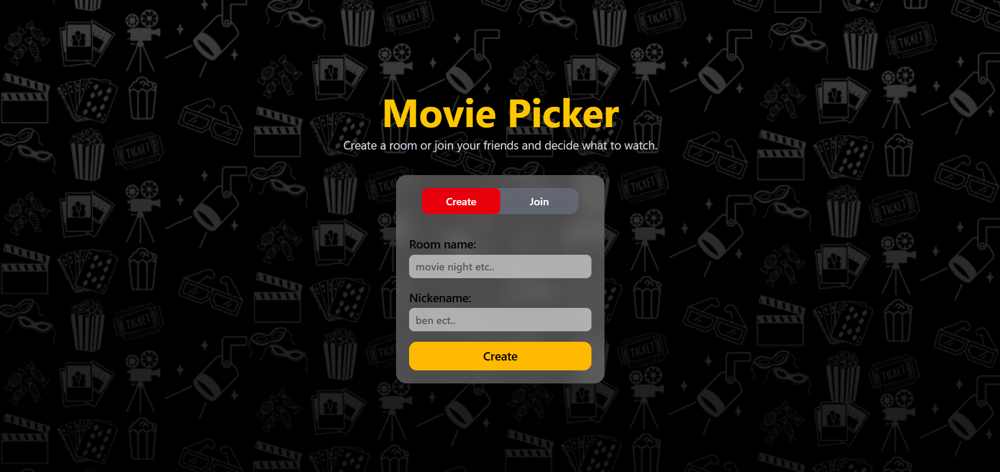

````markdown
# 🎬 Movie Picker

> Decide what to watch together — without spending forever deciding.

🔗 **Live Demo:** [https://movie-picker-wheat.vercel.app/](https://movie-picker-beige-kappa.vercel.app/)

💻 **GitHub Repository:** [https://github.com/aymansiddiqui2006/MoviePicker](https://github.com/aymansiddiqui2006/MoviePicker)

---

## 📌 About The Project

Have you ever planned a movie night with friends but ended up spending more time deciding what to watch than actually watching it?

**Movie Picker** is a real-time collaborative movie selection web application built to solve this simple but common problem.

Users can create a room, invite friends using a room code, browse movies from different categories, select movies, and vote together to decide what everyone should watch.

The application uses **Socket.IO** for real-time communication, allowing multiple participants in the same room to stay synchronized while interacting with the application.

This project was built as a practical full-stack development project to understand how frontend, backend, database, REST APIs, and real-time communication work together in a complete application.

---

## ✨ Features

### 🏠 Create a Room

- Create a new movie room.
- Generate a unique room code.
- The room creator automatically becomes the host.
- Share the room with friends.

### 👥 Join a Room

- Join an existing room using a room code.
- Choose a nickname before joining.
- Multiple participants can join the same room.

### 🔗 Share Room Invitation

Users can easily copy and share an invitation containing:

- Room name
- Room code
- Movie Picker link

Example:

> 🎬 You're invited to a Movie Picker room!  
> Join the room and vote together to decide what to watch.  
> 🔑 Room Code: X4A9KP  
> 🔗 Open Movie Picker and enter the room code.

### 🎥 Movie Discovery

Movies are fetched using the **TMDB API**.

Users can browse movies through different categories:

- 🔥 Popular
- ⭐ Top Rated
- 🇮🇳 Bollywood
- 🇺🇸 Hollywood
- 😂 Comedy
- 💥 Action
- 🎨 Animation

Each category also has a **See All** option to explore more movies.

### 🔍 Movie Details

Users can click on a movie to view more information through a movie details modal before deciding whether to consider it for voting.

### 🗳️ Voting

Participants can vote for movies inside the room.

The voting process allows everyone to participate in deciding what the group should watch.

### ⚡ Real-Time Communication

Socket.IO keeps participants connected to the same room and allows the application to handle real-time communication between users.

### 👑 Host Controls

The room creator becomes the host and has additional permissions.

The host can:

- Start the voting process.
- Manage the room.
- Remove participants.

Host-only actions are verified by the backend.

### 🗑️ Remove Participants

The host can remove a participant from the room.

The backend verifies that the requesting participant is actually the host before allowing the operation.

The host cannot remove themselves.

### 📱 Responsive Design

The interface is designed to work across:

- Mobile devices
- Tablets
- Laptops
- Desktop screens

---

# 🖥️ How It Works

The basic application flow is:

```text
Create Room
     ↓
Generate Room Code
     ↓
Invite Friends
     ↓
Friends Join Room
     ↓
Browse Movies
     ↓
Select / Explore Movies
     ↓
Start Voting
     ↓
Participants Vote
     ↓
Determine Winning Movie
````

---

## 🏠 1. Create a Room

A user creates a new room.

The backend:

1. Creates the room.
2. Generates a unique room code.
3. Creates the host participant.
4. Stores the room information in MongoDB.
5. Returns the room information to the frontend.

---

## 👥 2. Join the Room

Other users can join using the room code.

They provide:

```text
Room Code
+
Nickname
```

The backend verifies the room and creates a participant associated with that room.

---

## 🔌 3. Connect to the Room

After joining, participants connect to the Socket.IO server.

Each participant joins a Socket.IO room using the room code.

Conceptually:

```javascript
socket.join(roomCode);
```

This allows Socket.IO to organize users based on their movie room.

---

## 🎬 4. Browse Movies

The frontend communicates with the TMDB API and retrieves movie information.

Users can explore:

```text
Popular
Top Rated
Bollywood
Hollywood
Comedy
Action
Animation
```

---

## 🗳️ 5. Start Voting

The host can start the voting process.

The backend verifies the participant and updates the room state.

Participants can then enter the voting stage.

---

## ⚡ 6. Vote Together

Participants vote for the movies they prefer.

Socket.IO is used to keep the room synchronized between connected participants.

---

## 🏆 7. Choose the Winner

After the voting process finishes, the application determines the movie with the highest number of votes.

The group can then watch the winning movie.

---

# ⚡ Real-Time Communication

One of the main technical features of Movie Picker is real-time communication.

The application uses **Socket.IO** to allow multiple users to communicate through the same room.

The basic architecture looks like this:

```text
              Socket.IO Server
                     │
          ┌──────────┼──────────┐
          │          │          │
          ▼          ▼          ▼
       User A     User B     User C
          │          │          │
          └──────────┼──────────┘
                     │
                  Room Code
```

When users join the same room, they are connected to the same Socket.IO room.

For example:

```javascript
socket.emit("join-room", roomCode);
```

The backend handles the room:

```javascript
io.on("connection", (socket) => {
    socket.on("join-room", (roomCode) => {
        socket.join(roomCode);
    });
});
```

This makes it possible to build real-time collaborative features.

---

# 👑 Host Authorization

The host has additional permissions inside the room.

However, these permissions are not controlled only through the frontend.

Before performing a host-only operation, the backend verifies the requesting participant.

For example:

```text
Request
   ↓
Find Room
   ↓
Find Participant
   ↓
Check Participant == Host
   ↓
Allow / Reject Operation
```

If the participant is not the host, the backend rejects the request.

This helped me understand an important backend development principle:

> **Frontend restrictions are not enough for authorization.**

The backend must always verify whether the user is allowed to perform an operation.

---

# 🗑️ Removing Participants

The host can remove another participant from the room.

The backend:

1. Finds the room.
2. Finds the requesting participant.
3. Verifies that the participant is the host.
4. Finds the target participant.
5. Prevents the host from removing themselves.
6. Removes the participant from the room.
7. Deletes the participant record.

The endpoint follows this structure:

```text
DELETE
/api/v1/room/:roomCode/:nickname/member/:participantName
```

---

# 🏗️ Application Architecture

Movie Picker follows a client-server architecture.

```text
                       ┌──────────────────────┐
                       │      React App       │
                       │      Frontend        │
                       └──────────┬───────────┘
                                  │
                         HTTP / Axios
                                  │
                                  ▼
                       ┌──────────────────────┐
                       │    Express Server    │
                       │       Backend        │
                       └──────────┬───────────┘
                                  │
                   ┌──────────────┴──────────────┐
                   │                             │
                   ▼                             ▼
          ┌─────────────────┐           ┌─────────────────┐
          │     MongoDB     │           │    Socket.IO    │
          │    Database     │           │ Real-Time Layer │
          └─────────────────┘           └─────────────────┘
```

---

# 🛠️ Tech Stack

## Frontend

* React.js
* Vite
* Tailwind CSS
* React Router
* Axios
* Socket.IO Client
* React Hot Toast

## Backend

* Node.js
* Express.js
* Socket.IO
* CORS

## Database

* MongoDB
* Mongoose

## External API

* TMDB API

## Deployment

* Vercel — Frontend
* Render — Backend

---

# 📁 Project Structure

```text
MoviePicker/
│
├── frontend/
│   └── MoviePicker/
│       │
│       ├── public/
│       │
│       ├── src/
│       │   │
│       │   ├── components/
│       │   ├── context/
│       │   ├── elements/
│       │   ├── utils/
│       │   ├── App.jsx
│       │   └── main.jsx
│       │
│       ├── package.json
│       └── vite.config.js
│
├── backend/
│   │
│   ├── src/
│   │   ├── controllers/
│   │   ├── routes/
│   │   ├── models/
│   │   ├── connection/
│   │   └── utils/
│   │
│   ├── app.js
│   ├── index.js
│   └── package.json
│
└── README.md
```

---

# 🌐 API Structure

The backend API is organized under:

```text
/api/v1
```

## Room APIs

### Create Room

```http
POST /api/v1/room/create
```

### Join Room

```http
POST /api/v1/room/join
```

### Get Room

```http
GET /api/v1/room/:roomCode
```

### Start Voting

```http
PATCH /api/v1/room/:roomCode/:nickname/start-voting
```

### Start Vote

```http
PATCH /api/v1/room/:roomCode/:nickname/vote
```

### End Voting

```http
PATCH /api/v1/room/:roomCode/:nickname/end-voting
```

### Remove Participant

```http
DELETE /api/v1/room/:roomCode/:nickname/member/:participantName
```

---

# 🎨 Responsive UI

The application uses Tailwind CSS responsive utilities to adapt the layout to different screen sizes.

The movie grid changes depending on the device:

```text
Mobile
   ↓
2 columns

Small Tablet
   ↓
3 columns

Tablet
   ↓
4 columns

Desktop
   ↓
5 columns
```

Movie cards, buttons, typography, spacing, and layout are all adjusted using responsive Tailwind classes.

---

# 🚀 Getting Started

## Prerequisites

Before running the project, make sure you have:

* Node.js
* npm
* MongoDB or MongoDB Atlas
* TMDB API token
* Git

---

# 📥 Clone the Repository

```bash
git clone https://github.com/aymansiddiqui2006/MoviePicker.git
```

Then:

```bash
cd MoviePicker
```

---

# 🎨 Frontend Setup

Move into the frontend directory:

```bash
cd frontend/MoviePicker
```

Install dependencies:

```bash
npm install
```

Create a `.env` file:

```env
VITE_SERVER_URL=http://localhost:8000

VITE_BASE_URL=http://localhost:8000/api/v1

VITE_API_CODE=YOUR_TMDB_API_TOKEN
```

Start the frontend:

```bash
npm run dev
```

The frontend will run at:

```text
http://localhost:5173
```

---

# ⚙️ Backend Setup

Open another terminal.

Move into the backend:

```bash
cd backend
```

Install dependencies:

```bash
npm install
```

Create a `.env` file:

```env
PORT=8000

MONGODB_URI=YOUR_MONGODB_CONNECTION_STRING

CLIENT_URL=http://localhost:5173
```

Start the backend:

```bash
npm run dev
```

The backend will run at:

```text
http://localhost:8000
```

---

# 🔐 Environment Variables

## Frontend

```env
VITE_SERVER_URL=
VITE_BASE_URL=
VITE_API_CODE=
```

## Backend

```env
PORT=
MONGODB_URI=
CLIENT_URL=
```

Never commit your real environment variables or API keys to GitHub.

---

# 🧪 Testing

To test the real-time functionality:

### Browser 1

Create a room.

### Browser 2

Open the application in another browser or incognito window.

Join using the same room code.

### Browser 3

Join the same room with another nickname.

You can then test:

* Multiple participants
* Room joining
* Real-time communication
* Movie selection
* Voting
* Host controls
* Removing participants

---

# 🚧 Challenges Faced

## 1. Real-Time Communication

Understanding how multiple users can interact with the same room was one of the biggest challenges.

I had to learn how:

* Socket connections work
* Socket.IO rooms work
* Events are emitted
* Events are received
* Multiple clients communicate with the server

---

## 2. CORS

During development, the frontend and backend run on different origins.

For example:

```text
Frontend
http://localhost:5173

Backend
http://localhost:8000
```

This required configuring CORS correctly for both Express and Socket.IO.

---

## 3. Deployment

The frontend and backend are deployed separately.

```text
Frontend
        ↓
Vercel

Backend
        ↓
Render
```

This required correctly configuring:

* Production URLs
* Environment variables
* CORS
* API endpoints
* Socket.IO connections

---

## 4. React Router and Deployment

Since the frontend is a Single Page Application, directly refreshing a route could initially result in a `404` response on deployment.

This required configuring the deployment so that client-side React routes are handled correctly.

---

## 5. Host Authorization

Implementing host-only actions taught me that authorization should be handled on the backend.

The frontend can hide a button, but that does not make an API secure.

The backend must verify the requesting participant before performing sensitive operations.

---

# 📚 What I Learned

This project helped me understand much more than just React development.

## React

I learned more about:

* Component architecture
* React Router
* Context API
* State management
* `useEffect`
* API integration
* Conditional rendering
* Responsive UI

## Backend

I learned:

* Express.js
* REST API design
* Routes
* Controllers
* Middleware
* Error handling
* MongoDB
* Mongoose
* Backend authorization

## Real-Time Applications

I learned:

* Socket.IO
* WebSockets
* Socket.IO rooms
* Event-driven communication
* Client-server communication
* Real-time synchronization

## Deployment

I learned:

* Vercel deployment
* Render deployment
* Environment variables
* CORS configuration
* Production API configuration
* Frontend/backend communication

---

# 💡 Biggest Lesson From This Project

One of the most important lessons I learned while building Movie Picker was:

> **Plan before you code.**

Initially, it is very easy to start writing components and APIs immediately.

But as the project grows, it becomes difficult to remember:

```text
What should happen?
        ↓
What data is required?
        ↓
Which component handles it?
        ↓
Which API is required?
        ↓
What should the backend do?
        ↓
How should the frontend update?
```

I learned that spending some time drawing the application flow and thinking about the architecture before writing code can save a significant amount of time later.

This became especially important when implementing real-time features because a small change in the backend can affect the frontend, database, and Socket.IO communication.

---

# 🔮 Future Improvements

Some features I would like to add in future versions include:

### 🔐 Authentication

* User registration
* Login
* User profiles
* Persistent accounts

### 🎯 Better Voting

* Multiple voting rounds
* Ranked voting
* Different voting modes
* Better tie-breaking

### 🎬 Movie Features

* Personalized recommendations
* Favorite movies
* Watch history
* More movie categories
* Advanced movie filtering

### ⚡ Performance

* Movie caching
* Pagination
* Lazy loading
* Optimized API requests

### 👥 Room Improvements

* Private rooms
* Room expiration
* Better reconnect handling
* Participant status
* Improved host controls

### 🎨 UI/UX

* Better animations
* Improved mobile experience
* Better movie details
* Improved accessibility

---

# 📸 Screenshots

Add screenshots of the application here.

For example:

```text
screenshots/
│
├── home.png
├── create-room.png
├── join-room.png
├── movie-selection.png
├── room.png
└── voting.png
```

Then add them to this README:

```markdown





```

---

# 🌍 Deployment

## Frontend

The frontend is deployed using Vercel.

🔗 [https://movie-picker-beige-kappa.vercel.app/](https://movie-picker-beige-kappa.vercel.app/)

## Backend

The backend is deployed using Render.

🔗 [https://movie-picker-nwhi.onrender.com](https://movie-picker-nwhi.onrender.com)

---

# 🤝 Contributing

Contributions and suggestions are welcome.

If you would like to improve the project:

1. Fork the repository.
2. Create a new branch.

```bash
git checkout -b feature/new-feature
```

3. Make your changes.
4. Commit your changes.

```bash
git commit -m "Add new feature"
```

5. Push your branch.

```bash
git push origin feature/new-feature
```

6. Open a Pull Request.

---

# 📄 License

This project was created for educational and portfolio purposes.

---

# 👨‍💻 Author

## Ayman Siddiqui

Software Development Enthusiast

Interested in:

* Full-Stack Development
* React.js
* Node.js
* Real-Time Applications
* Software Engineering
* Data Structures & Algorithms

---

# ⭐ Support

If you found this project interesting or useful, consider giving the repository a ⭐.

Feedback, suggestions, and improvements are always welcome.

---

## 🔗 Links

🎬 **Live Demo:**
[https://movie-picker-beige-kappa.vercel.app/](https://movie-picker-beige-kappa.vercel.app/)

💻 **GitHub Repository:**
[https://github.com/aymansiddiqui2006/MoviePicker](https://github.com/aymansiddiqui2006/MoviePicker)

```

